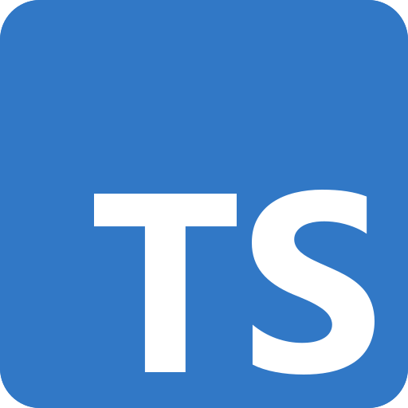

<!-- SkyScraper README -->
<!-- PROJECT LOGO -->

<p align="center">
  <a href="https://github.com/oslabs-beta/SkyScraper">
    
  </a>

  <h3 align="center">SkyScraper</h3>

  <p align="center">
    Visualizer dashboard for AWS EC2 instances
    <br />
    <!-- <a href="https://github.com/oslabs-beta/SkyScraper"><strong>Explore the docs »</strong></a>
    <br />
    <br /> -->
    <a href="https://github.com/oslabs-beta/SkyScraper/issues">Report Bug</a>
    ·
    <a href="https://github.com/oslabs-beta/SkyScraper/issues">Request Feature</a>
  </p>
    <!-- BADGES -->
  <p align="center">
    <!-- VSCode Version
    <a href="https://marketplace.visualstudio.com/items?itemName=team-SkyScraper.SkyScraper"></a> -->
    <!-- VSCode Installs -->
    <!-- <a href="https://marketplace.visualstudio.com/items?itemName=team-SkyScraper.SkyScraper"></a> -->
    <!-- STARS -->
    <!-- <a href="https://github.com/oslabs-beta/SkyScraper/stargazers"></a> -->
    <!-- FORKS -->
    <!-- <a href="https://github.com/oslabs-beta/SkyScraper/network/members"></a> -->
    <!-- GITHUB RELEASE VERSION -->
    <!-- <a href="https://github.com/oslabs-beta/SkyScraper/releases"></a> -->
    <!-- <br> -->
    <!-- BUILD STATUS -->
    <!-- <a href="https://github.com/oslabs-beta/SkyScraper/actions/workflows/master.yml"></a> -->
    <!-- <a href="https://github.com/oslabs-beta/SkyScraper/actions/workflows/dev.yml"></a> -->
    <!--  -->
    <!-- LICENSE -->
    <!-- <a href="https://github.com/oslabs-beta/SkyScraper/blob/master/LICENSE"></a> -->
    <!-- CONTRIBUTIONS -->
    <!-- <a href="https://github.com/oslabs-beta/SkyScraper/blob/master/README.md"></a> -->
  </p>
</p>

<hr>

<!-- TABLE OF CONTENTS -->
<details open="open">
  <summary>Table of Contents</summary>
  <ol>
    <li>
      <a href="#about-the-project">About The Project</a>
        <li><a href="#built-with">Built With</a></li>
    </li>
    <li><a href="#installation">Installation</a></li>
    <li>
      <a href="#getting-started">Getting Started</a></li>
    <li><a href="#usage">Usage</a></li>
    <li><a href="#extension-settings">Extension Settings</a></li>
    <li><a href="#contributing">Contributing</a></li>
    <li><a href="#license">License</a></li>
    <li><a href="#creators">Creators</a></li>
    <li><a href="#contact">Contact</a></li>
    <li><a href="#acknowledgements">Acknowledgements</a></li>

  </ol>
</details>

<hr>

## About The Project

<br/>
<p align="center">
  
</p>
<br/>

SkyScraper is a visualizer dashboard that displays performance metrics of AWS services. Starting with EC2, AWS users can visualize their EC2 Instances alongside their metrics in graph and chart format

With SkyScraper, you can optimize your spending by using the visuals to make informed decisions on which services you keep active and which need to be paused.

### Built With

- [](https://www.typescriptlang.org/) [TypeScript](https://www.typescriptlang.org/)
- [](https://reactjs.org/) [React](https://reactjs.org/)
- [](https://redux-toolkit.js.org/) [Redux Toolkit](https://redux-toolkit.js.org/)
- [](https://nodejs.org/en) [Node.js](https://nodejs.org/en)
- [](https://expressjs.com/) [Express](https://expressjs.com/)
- [](https://www.chartjs.org/) [ChartJS](https://www.chartjs.org/)
- [](https://webpack.js.org/) [Webpack](https://webpack.js.org/)
- [](https://docs.aws.amazon.com/AWSEC2/latest/APIReference/Welcome.html) [AWS EC2 API](https://docs.aws.amazon.com/AWSEC2/latest/APIReference/Welcome.html)
- [](https://docs.aws.amazon.com/AmazonCloudWatch/latest/APIReference/Welcome.html) [AWS CloudWatch API](https://docs.aws.amazon.com/AmazonCloudWatch/latest/APIReference/Welcome.html)

## Installation

Installing from Github:

1. git clone https://github.com/oslabs-beta/SkyScraper.git
1. open the SkyScraper repo locally in your code editor
1. create a .env file in root directory using the template as a reference
1. npm install
1. npm run go
1. view app on your localhost

## Getting Started

1. Please sign up with Amazon EC2 if you do not have an account
2. Launch an instance if you have not already
3. If you have an Amazon EC2 account and launched one or more instances, you can securely sign into our app using Auth0

## Usage

1. Click Get Started
1. Log in with Auth0
1. Once securely logged in, you will see an overview of the name and status of your instance. You can click on any instance displayed and it will navigate you to another page where you can view more statistics about each instance.
1. Once at the statistics page, you can click drop down menu for each instance listed and view individual statistics.

<!-- Icon Legend in SkyScraper Tree View:

- []() available props (hover)
- []() open file (click)
- []() Redux store connection

SkyScraper can currently display metrics for EC2 Instances.

### Contributor Usage

1. Download/clone the project from [Github](https://github.com/oslabs-beta/SkyScraper/)
2. Work on it
3. Make a PR and contribute your changes
<!-- ```JSX
    <Navbar />

    // As above
    <Navbar></Navbar>

````-->

<!-- SkyScraper will detect the names of inline props for JSX components it identifies:

```JSX
    <Navbar userId={...} userName={...} />
````

SkyScraper can identify components connected to the Redux store, when 'connect' is imported from 'react-redux', and the component is the export default of the file:

````JSX
    // App.jsx
    import React from 'react';
    import { connect } from 'react-redux';

    const mapStateToProps = ...
``` -->

## Contributing

Contributions are what make the open source community such an amazing place to learn, inspire, and create. Any contributions you make are **greatly appreciated**.

1. Fork the Project
2. Create your Feature Branch (`git checkout -b feature/AmazingFeature`)
3. Commit your Changes (`git commit -m 'Add some AmazingFeature'`)
4. Push to the Branch (`git push origin feature/AmazingFeature`)
5. Open a Pull Request

## License

Distributed under the MIT License. See [`LICENSE`](https://github.com/oslabs-beta/SkyScraper/LICENSE) for more information.

## Creators

- [Abel](https://github.com/abelr20)
- [Bin](https://github.com/b-the-coder)
- [Christie](https://github.com/ChristieLaf)
- [Tripp](https://github.com/TrippMurphy)
- [Nikola](https://github.com/Nikolaa92)

## Contact

[]() : [@SkyScraperApp](https://x.com/SkyScraperApp) | Email: AppSkyScraper@gmail.com

[]() : [https://github.com/oslabs-beta/SkyScraper/](https://github.com/oslabs-beta/SkyScraper/)

## Acknowledgements

<!-- - Tooltips with [Tippy](https://www.npmjs.com/package/@tippy.js/react) -->

- [Best README Template](https://github.com/othneildrew/Best-README-Template)
  <!-- - Parsing Strategy inspired by [React Component Hierarchy](https://www.npmjs.com/package/react-component-hierarchy) -->
  <!-- - Readme badges from [shields.io](https://shields.io/) -->
  <!-- - Icons from [Font Awesome](https://fontawesome.com) -->
